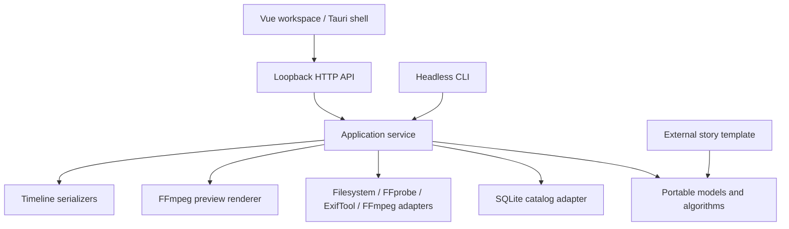

# Architecture

OpenFilm is a local media and story engine with multiple application entry points.
All edit quantities use seconds; originals are referenced and never rewritten by
import or composition. The engine produces decisions and operations that a preview
renderer or timeline exporter can consume.

## Packages and boundaries

| Package       | Responsibility                                                                          |
| ------------- | --------------------------------------------------------------------------------------- |
| `core`        | Media, event, story, composition, project, and job models; schema validation/migration. |
| `plugin-sdk`  | Extension ports/manifests and provider disclosure/consent validation.                   |
| `metadata`    | Portable capture timestamp resolution.                                                  |
| `events`      | Exact/perceptual groups and deterministic event clustering.                             |
| `story`       | Generic story construction and explainable offline ranking.                             |
| `solver`      | Unique asset selection, ordering, duration allocation, and constraint failures.         |
| `analysis`    | Portable AI provider registry with per-invocation consent/disclosure checks.            |
| `exporters`   | JSON, OTIO, FCPXML, and EDL serialization.                                              |
| `catalog`     | Node SQLite persistence and paginated descriptors.                                      |
| `media`       | Local discovery, executable invocation, inspection, hashes, thumbnails, and proxies.    |
| `render`      | Composition-to-FFmpeg preview adapter.                                                  |
| `application` | Workflow orchestration and project persistence shared by CLI/API.                       |
| `ui`          | Reserved package; current desktop helpers live in the application.                      |

Portable packages do not import Node, Vue, or Tauri. The application orchestrates
concrete local adapters through the same models; it deliberately avoids a general
dependency-injection framework. Scenario-specific language belongs to external
template packages. The first official template is registered by the application;
the SDK defines extension contracts, while arbitrary plugin discovery is future
work.

## Import and analysis

Filesystem discovery yields supported file candidates lazily and avoids symlink
traversal. Import runs at most three file tasks concurrently. Each task inspects
media, normalizes metadata, fingerprints content, generates derived outputs, and
commits the catalog record. One malformed file becomes a structured job error
with its URI and stage instead of stopping the batch.

Completed files and cache outputs are reused on subsequent import. Hashes are
checked before and after processing so externally changing media is retried.
Preference edits survive reinspection. Interrupted queued/running jobs are marked
failed on reopen with an explicit reimport instruction; the process does not claim
to resume an in-flight decoder at an arbitrary byte offset.

Analysis reads compact paged descriptors, then groups them in memory. It does not
decode all media or load complete EXIF/FFprobe blobs, but grouping still materializes
the descriptor collection and runs synchronously. Incremental analysis and
archive-scale worker/latency validation remain future work.

## Story and solver semantics

Candidates are partitioned chronologically by story creation. Ranking uses
observable user preference, dimensions, uniqueness, chronology, tags, and event
context; returned factors explain the score. No external model is used.

Selected IDs and must-include IDs are required in their beat; library locks are
required globally. Must-exclude and rejected media are ineligible. An asset can
appear once. Beat order is fixed; explicit selection/asset-order edges are retained,
and a chronological constraint can detect an incompatible manual order.

Maximum durations, beat minima, source bounds, and inclusion are hard constraints.
Targets are soft. Clips normally start from 4-second still/6-second motion pacing
and can stretch toward targets up to 12 seconds; hard minima can use longer still
holds or source durations. A playable clip has a minimum of one second or its
shorter source length. Unknown-duration moving/audio media cannot be required
without inspection. Candidate overlap and lock placement use bounded search;
complex search failures instruct users to narrow pools or pin selections.

The application caps a story scope at 2,000 candidates, including locks. Catalog
pagination supports larger libraries, but no 100,000-asset benchmark or unrestricted
story-scale guarantee is implied.

## Local service and native shell

The HTTP adapter binds only to `127.0.0.1:4310`, validates Host/origin/write bodies,
and exposes project, catalog, job, story, preview, and export operations. The Vue
workspace runs on port 1420 during development. Errors use non-success responses
with actionable text. Remote provider ports exist; the default application does
not instantiate a remote provider.

Tauri supplies native folder selection and can spawn a configured local Node
service, stopping its owned child on exit. It does not replace the Node media and
SQLite adapters. Development starts the service separately; deployment must
supply a verified runtime, service, media tools, and update/installer integration.

See [the integration contracts](CONTRACTS.md), [project format](project-format.md),
and [ADRs](adr/001-monorepo.md) for public interfaces and design decisions.
