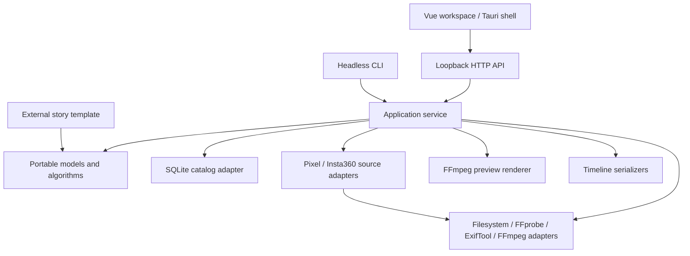

# Architecture

OpenFilm is a local media and story engine with multiple application entry points.
All edit quantities use seconds; originals are referenced and never rewritten by
import or composition. The engine produces decisions and operations that a preview
renderer or timeline exporter can consume.

The Desktop product layer uses stable Library/Story/Edit/Export workspace IDs,
Vue I18n catalogs and local preferences. UI locale never enters a domain state
discriminator or changes project content. Optional film locale/settings and
template/user text provenance stay in portable models; template packages supply
their own content catalogs. See [internationalization](i18n.md) and
[product workflow](product-workflow.md).

Application errors carry stable codes and parameters, with diagnostic detail
preserved for CLI/debug use. The frontend localizes the code at display time.
The same application import pipeline accepts native paths and validated browser
upload receipts. Uploads stream only to local project-managed sources, while
ordinary native imports continue referencing originals. MP4 export renders the
current composition into an atomic finished output rather than reusing a stale
preview. No new remote service or alternate composition engine is introduced.

## Packages and boundaries

| Package           | Responsibility                                                                            |
| ----------------- | ----------------------------------------------------------------------------------------- |
| `core`            | Media, event, story, composition, project, and job models; schema validation/migration.   |
| `plugin-sdk`      | Extension ports/manifests and provider disclosure/consent validation.                     |
| `metadata`        | Portable capture timestamp resolution.                                                    |
| `events`          | Exact/perceptual groups and deterministic event clustering.                               |
| `story`           | Generic story construction and explainable offline ranking.                               |
| `solver`          | Composition, pure timeline commands, scoped beat regeneration and shortening suggestions. |
| `analysis`        | Portable AI provider registry with per-invocation consent/disclosure checks.              |
| `exporters`       | JSON, OTIO cut layout with metadata-only advanced edits/warnings, limited FCPXML and EDL. |
| `catalog`         | Node SQLite persistence, paginated descriptors and atomic source-location updates.        |
| `media`           | Local inspection, source matching/status, hashes and safe thumbnail/proxy conversion.     |
| `source-pixel`    | Pixel metadata/Motion Photo evidence and DNG inspection through existing source ports.    |
| `source-insta360` | Flat export metadata and original-source associations; raw/spherical preview limits.      |
| `render`          | Composition-to-FFmpeg preview adapter.                                                    |
| `application`     | Import/render/export orchestration, durable editing and relinking shared by CLI/API.      |
| `ui`              | Reserved package; current desktop helpers live in `apps/desktop`.                         |

Portable packages do not import Node, Vue, or Tauri. The application orchestrates
concrete local adapters through the same models; it deliberately avoids a general
dependency-injection framework. Scenario-specific language belongs to external
template packages. The first official template is registered by the application;
the SDK defines extension contracts, while arbitrary plugin discovery is future
work.

## Import and analysis

The 0.3 foundation adds portable transcript/word timing, waveforms, scenes and
generic markers to Core. `@openfilm/provider-whisper` implements the existing SDK
transcription port through optional local Python/faster-whisper. A user-supplied
model and GPU-to-CPU fallback leave Python/model installation optional for all
other workflows. Registry consent rules remain intact.

Catalog version 2 stores validated source-hash/version-bound intelligence outside
MediaAsset and project.json. Indexed transcript revisions support bounded reads;
failed/cancelled replacement preserves earlier results. Application operations
check source identity before reuse and successful commit and use existing durable
Jobs. Waveform decoding streams bounded peaks; scene detection downsizes frames.

CLI, API and Desktop share these operations. Precision mode separates source and
composition seconds and applies snapping, trim and split through the existing
TimelineCommand history. Analysis does not rewrite Story or composition. See
[media intelligence](media-intelligence.md) and [reference decisions](vidscribe-reference.md).

Filesystem discovery yields supported file candidates lazily and avoids symlink
traversal. Import runs at most three file tasks concurrently. Each task inspects
media, normalizes metadata, fingerprints content, generates derived outputs, and
commits the catalog record. One malformed file becomes a structured job error
with its URI and stage instead of stopping the batch.

Completed files and cache outputs are reused on subsequent import. Hashes are
checked before and after processing so externally changing media is retried.
Preference edits survive reinspection. Interrupted queued/running jobs are marked
failed on reopen with an explicit reimport instruction; the process does not claim
to resume an in-flight decoder at an arbitrary byte offset.

Device adapters add namespaced metadata through existing source ports. Recognized
raw/spherical media and undecodable DNG remain catalog entries with actionable
preview limits; unsupported sources do not silently enter flat preview or automatic
composition. Supported HDR previews require known color metadata and FFmpeg tone
mapping filters. Original files and inspected metadata remain intact. See
[source support](source-support.md) for generated-fixture evidence and remaining
camera/hardware checks.

Analysis reads compact paged descriptors, then groups them in memory. It does not
decode all media or load complete EXIF/FFprobe blobs, but grouping still materializes
the descriptor collection and runs synchronously. Incremental analysis and
archive-scale worker/latency validation remain future work.

## Story and solver semantics

Candidates are partitioned chronologically by story creation. Ranking uses
observable user preference, dimensions, uniqueness, chronology, tags, and event
context; returned factors explain the score. No external model is used.

Selected IDs and must-include IDs are required in their beat; library locks are
required globally. Must-exclude and rejected media are ineligible. An asset can
appear once. Beat order is fixed; explicit selection/asset-order edges are retained,
and a chronological constraint can detect an incompatible manual order.

Automatic composition treats maximum durations, beat minima, source bounds and
inclusion as hard constraints. Targets are soft. Clips normally start from
4-second still/6-second motion pacing
and can stretch toward targets up to 12 seconds; hard minima can use longer still
holds or source durations. A playable clip has a minimum of one second or its
shorter source length. Unknown-duration moving/audio media cannot be required
without inspection. Candidate overlap and lock placement use bounded search;
complex search failures instruct users to narrow pools or pin selections.

The application caps a story scope at 2,000 candidates, including locks. Catalog
pagination supports larger libraries, but no 100,000-asset benchmark or unrestricted
story-scale guarantee is implied.

## Editing and source relocation

The solver applies pure commands to composition/story snapshots. The application
editor validates runtime command input, checks content revisions, persists a batch
before acknowledging it, and retains bounded undo/redo history for the open
project session. Validation or write failure preserves the previous document and
history. Clip locks and required-source constraints protect automatic changes;
manual over-limit cuts remain saveable, with rendering blocked until shortened.
The editor extends the current project model and application service. See
[editing contracts](EDITING_CONTRACTS.md).

The media adapter checks availability and proposes hash-first relink candidates.
The application owns bounded, expiring plans and revalidates selected files; the
catalog commits reference/location changes in one SQLite transaction while
preserving current user edits. Current roots live in
`metadata["openfilm.reference"]`, avoiding a JSON/SQLite transaction. Asset IDs and
timeline references survive relinking and subsequent import. Cache paths are
project-relative; location/cache changes do not invalidate timeline undo history.
Source availability is transient. Logical volume identity supports explicit
remounting, with physical-volume auto-detection deferred. See
[media portability](media-portability.md) and [relinking contracts](RELINK_CONTRACTS.md).

## Interchange boundaries

OTIO carries native cut layout, source references, still holds, audio and gaps.
Advanced edits are preserved in OpenFilm metadata with explicit compatibility
warnings and an adjacent report. Speed edits use unretimed native excerpts and
padding where needed; NLE effects must be recreated manually. FCPXML and EDL keep
their existing restrictions. The official OTIO parser gate verifies structure,
timing and preserved metadata using generated real sources; it does not verify
Resolve import or playback. See [NLE compatibility](nle-compatibility.md).

## Local service and native shell

The HTTP adapter binds to `127.0.0.1` (port 4310 by default), validates Host/origin/write bodies,
and exposes project, catalog, job, story, timeline editing, relinking, preview and
export operations. Mutations are serialized; relinking and project replacement
are blocked while import/render jobs run. The Vue
workspace runs on port 1420 during development. Errors use non-success responses
with actionable text. Remote provider ports exist; the default application does
not instantiate a remote provider.

Tauri supplies native folder selection and can spawn a configured local Node
service, stopping its owned child on exit. It does not replace the Node media and
SQLite adapters. Development starts the service separately; deployment must
supply a verified runtime, service, media tools, and update/installer integration.

See [the integration contracts](CONTRACTS.md), [project format](project-format.md),
and [ADRs](adr/001-monorepo.md) for public interfaces and design decisions.
